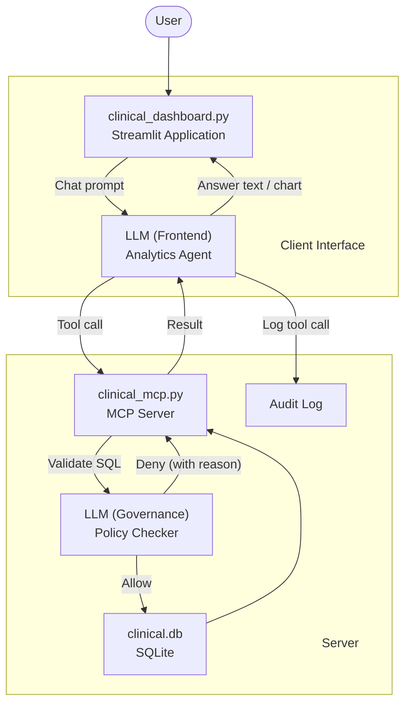

# (Technical Demo) LLMs + MCP for Clinical Analytics

[](https://www.python.org/downloads/release/python-3120/)
[](https://opensource.org/licenses/MIT)

A demonstration of using Large Language Models (LLMs) and the Model Context Protocol (MCP) for generative clinical analytics with data governance guardrails.



## Project Structure

```
mcpclinical-demo/
├── clinical_dashboard.py   # Streamlit UI for interacting with the clinical data
├── clinical_mcp.py         # MCP server that provides secure access to the database
├── Dockerfile              # Docker configuration for containerized setup
├── docker-compose.yml      # Docker Compose configuration
├── Makefile                # Automation commands for running different components
├── pyproject.toml          # Python project dependencies and configuration
├── support/
│   ├── generate_clinical.py  # Script to generate synthetic clinical data
│   ├── prompts.py            # LLM prompts and instructionsfor the dashboard
│   ├── study_protocol.md     # Study protocol used for data governance rules
│   └── styles.css            # CSS styles for the dashboard
└── uv.lock                 # Lock file for Python dependencies
```

## Setup Options

You can run this project in two ways:
1. [Using Docker](#option-1-using-docker) (recommended for quick setup)
2. [Local Installation](#option-2-local-installation) (recommended for development)

## Option 1: Using Docker

### Prerequisites

- [Docker](https://docs.docker.com/get-docker/) and [Docker Compose](https://docs.docker.com/compose/install/) installed
- [ngrok account](https://ngrok.com/signup) (free tier is sufficient)
- [OpenAI API key](https://platform.openai.com/account/api-keys)

> ### Why ngrok?
> The Model Context Protocol (MCP) requires that the MCP server be accessible via a public HTTPS URL.
> `ngrok` solves this by creating a secure tunnel from a public HTTPS endpoint to your locally running MCP server. This allows:
> - Your MCP server to run on your local machine (keeping data local)
> - The LLM to securely access your server via the ngrok URL
> - No need to deploy your server to a public cloud service

### Setup Instructions

#### 1. Clone the Repository

```bash
git clone https://github.com/twu13/mcpclinical-demo.git
cd mcpclinical-demo
```

#### 2. Create Required Accounts

##### ngrok Account
1. Sign up at https://ngrok.com/signup
2. After signing in, go to https://dashboard.ngrok.com/get-started/your-authtoken
3. Copy your authtoken

##### OpenAI API Key
1. Sign up at https://platform.openai.com/signup
2. Go to https://platform.openai.com/account/api-keys
3. Create a new API key and copy it

#### 3. Create .env File

Create a .env file with your API keys:

```bash
# Create .env file
cat > .env << EOL
NGROK_AUTHTOKEN=your_ngrok_authtoken_here
OPENAI_API_KEY=your_openai_api_key_here
EOL
```

Edit the `.env` file and replace the placeholder values with your actual tokens.

#### 4. Build and Run the Application

```bash
docker-compose up --build
```

#### 5. Access the Application

- **Streamlit UI**: http://localhost:8501
- **MCP server**: http://localhost:8000
- **ngrok interface**: http://localhost:4040 (to see your public URL)

#### 6. Stopping the Application

Press `Ctrl+C` in the terminal where docker-compose is running, or run:

```bash
docker-compose down
```

### Docker Troubleshooting

#### API Key Issues
- Verify both your ngrok authtoken and OpenAI API key are correct in the .env file
- Check if your OpenAI API key has sufficient credits/quota

#### Port Conflicts
- If you have services already using ports 8501, 8000, or 4040, modify the port mappings in docker-compose.yml:
  ```yaml
  ports:
    - "8502:8501"  # Maps host port 8502 to container port 8501
  ```

## Option 2: Local Installation (Non-Docker)

### Prerequisites

- Python 3.12+ and [uv package manager](https://github.com/astral-sh/uv)
- [ngrok account](https://ngrok.com/signup) (free tier is sufficient)
- [OpenAI API key](https://platform.openai.com/account/api-keys)

### Setup Instructions

#### 1. Clone the Repository

```bash
git clone https://github.com/twu13/mcpclinical-demo.git
cd mcpclinical-demo
```

#### 2. Install Dependencies

1. **Install ngrok** (if not already installed)
   ```bash
   # macOS with Homebrew
   brew install ngrok
   ```

2. **Create and activate a virtual environment with uv**
   ```bash
   uv venv
   source .venv/bin/activate 
   ```

3. **Install project dependencies**
   ```bash
   uv sync
   ```

#### 3. Create Required Accounts

##### ngrok Account
1. Sign up at https://ngrok.com/signup
2. After signing in, go to https://dashboard.ngrok.com/get-started/your-authtoken
3. Copy your authtoken
3. Configure ngrok with your token:
   ```bash
   ngrok config add-authtoken YOUR_AUTH_TOKEN
   ```

##### OpenAI API Key
1. Sign up at https://platform.openai.com/signup
2. Go to https://platform.openai.com/account/api-keys
3. Create a new API key and copy it
4. Set this key in your environment:
   ```bash
   export OPENAI_API_KEY=your-api-key-here
   ```

### Running the Demo

#### Step-by-Step Guide

1. **Generate synthetic clinical trial data**
   ```bash
   make data
   ```
   This creates a SQLite database (`clinical.db`) with synthetic clinical data.

2. **Start the MCP server**
   ```bash
   make server
   ```
   This starts the MCP server on port 8000, which will provide secure access to the clinical data.

3. **In a new terminal, expose the server using ngrok**
   ```bash
   make ngrok
   ```
   This:
   - Creates a secure tunnel to your local MCP server
   - Generates a `config.json` file with the ngrok URL
   - The config file is used by the dashboard to connect to the MCP server

4. **In another terminal, run the dashboard**
   ```bash
   make client
   ```
   This starts a Streamlit web interface where you can:
   - Ask questions about the clinical data in natural language
   - The dashboard uses your OpenAI API key to communicate with the LLM

5. **Access the dashboard**
   Open your browser and go to http://localhost:8501

#### Alternative: All-in-One Setup

For convenience, you can run all components at once:
```bash
make dev
```
This starts the server, ngrok, and dashboard in parallel processes.

### Stopping the Demo

When you're done, stop all services:
```bash
make stop
```

## Security Note

- The `.env` file contains sensitive API keys. Do not commit this file to public repositories.
- Add `.env` to your `.gitignore` file to prevent accidental commits.
